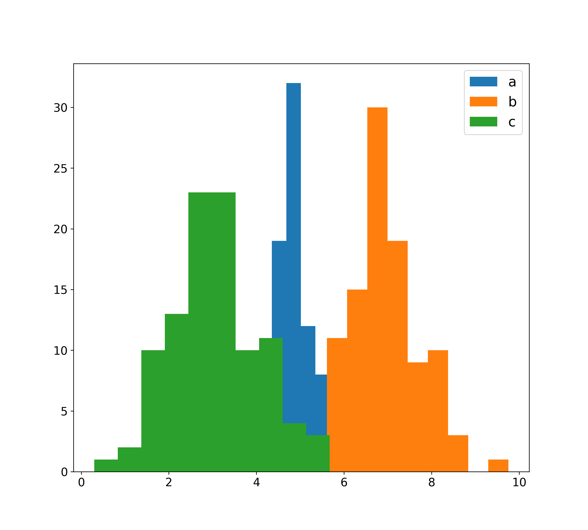

Metrics and Figures
====================

Metrics and Figures are the primary tools prognostics researchers use to understand data, measure performance, and compare methods and models. There are several metrics and figures included in `prog_algs`, most of which are implemented as methods in the various prognostic data structures: `UncertainData`, `Prediction`, and `ToEPredictionProfile`. The supported metrics and figures are described below, divided by structure that they act on.

..  contents:: 
    :backlinks: top

.. role:: raw-html(raw)
    :format: html

UncertainData Metrics and Figures
------------------------------------------------
The following metrics and figures act on any UncertainData type (e.g., `MultivariateNormalDist`, `UnweightedSamples`, or `ScalarData`). They are meant to provide useful information about a distribution (e.g., predicted state at a future point, Time of Event).

Simple Statistics
^^^^^^^^^^^^^^^^^^^^^

.. automethod:: prog_algs.uncertain_data.UncertainData.mean

:raw-html:` `

.. automethod:: prog_algs.uncertain_data.UncertainData.median

:raw-html:` `

.. automethod:: prog_algs.uncertain_data.UncertainData.cov

:raw-html:` `

.. automethod:: prog_algs.uncertain_data.UncertainData.percentage_in_bounds

:raw-html:` `

.. automethod:: prog_algs.uncertain_data.UncertainData.metrics

:raw-html:` `

.. automethod:: prog_algs.uncertain_data.UncertainData.describe

Relative Accuracy
^^^^^^^^^^^^^^^^^^^^

.. automethod:: prog_algs.uncertain_data.UncertainData.relative_accuracy

Histogram
^^^^^^^^^^^^^^^^^^^^
.. automethod:: prog_algs.uncertain_data.UncertainData.plot_hist

Scatter Plot
^^^^^^^^^^^^^^^^^^^^
.. automethod:: prog_algs.uncertain_data.UncertainData.plot_scatter
.. image:: images/scatter_plt_ex.png

Time of Event Metrics
^^^^^^^^^^^^^^^^^^^^^^^
These metrics operate on a UncertainData object that represents the distribution of time of events

.. autofunction:: prog_algs.metrics.prob_success

Prediction Metrics and Figures
------------------------------------------------
The following metrics and figures act on a Prediction (i.e., data describing future states). They are meant to provide useful information about the prediction. 

Simple Statistics
^^^^^^^^^^^^^^^^^^^^^

.. automethod:: prog_algs.predictors.prediction.Prediction.mean

:raw-html:` `

.. automethod:: prog_algs.predictors.prediction.Prediction.monotonicity

Toe Prediction Profile Metrics and Figures
------------------------------------------------
The following metrics and figures act on a ToePrediction Profile (i.e., ToE estimates made at multiple points). They are meant to provide useful information about the ToEPredictionProfile.

Alpha-Lambda
^^^^^^^^^^^^^^^
.. automethod:: prog_algs.predictors.toe_prediction_profile.ToEPredictionProfile.alpha_lambda

Cumulative Relative Accuracy
^^^^^^^^^^^^^^^^^^^^^^^^^^^^^^
.. automethod:: prog_algs.predictors.toe_prediction_profile.ToEPredictionProfile.cumulative_relative_accuracy

Monotonicity
^^^^^^^^^^^^^
.. automethod:: prog_algs.predictors.toe_prediction_profile.ToEPredictionProfile.monotonicity

Prognostics Horizon
^^^^^^^^^^^^^^^^^^^^^
.. automethod:: prog_algs.predictors.toe_prediction_profile.ToEPredictionProfile.prognostic_horizon

Alpha-Beta Plot
^^^^^^^^^^^^^^^^^
.. automethod:: prog_algs.predictors.toe_prediction_profile.ToEPredictionProfile.plot
.. image:: images/alpha_lambda_plt_ex.png
